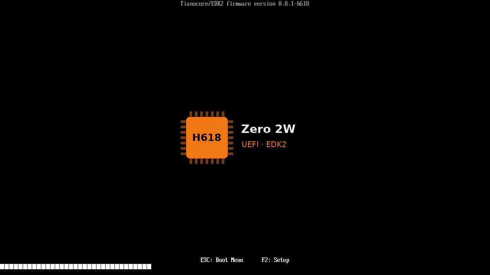
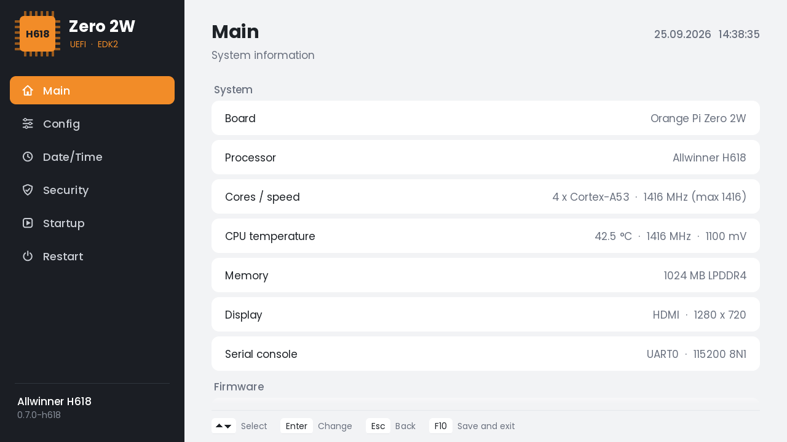
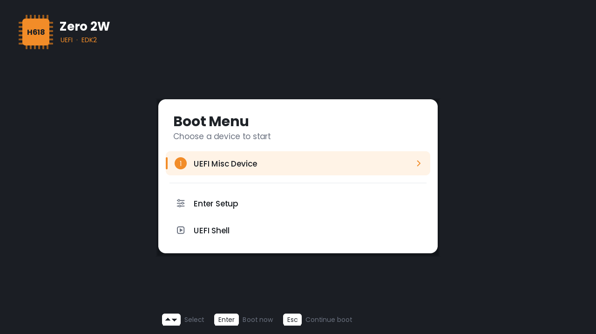
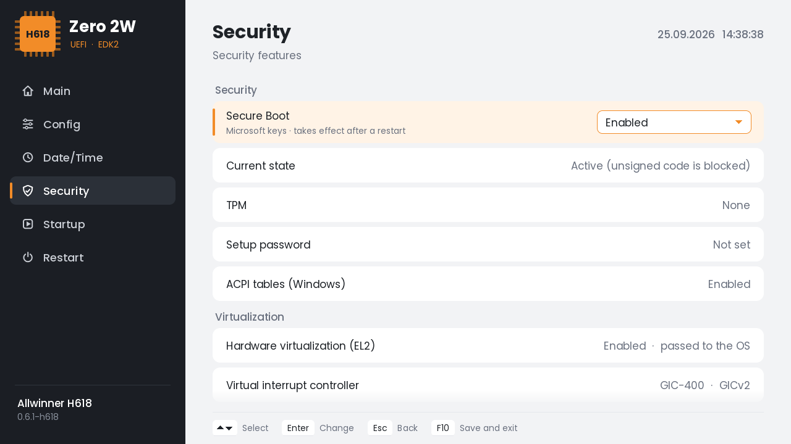
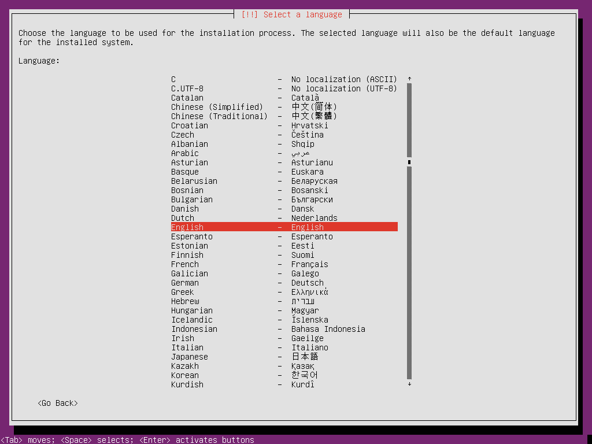

# Orange Pi Zero 2W UEFI

UEFI firmware (TianoCore EDK2) for the **Orange Pi Zero 2W** (Allwinner H618, 1 GB).
It replaces U-Boot proper: the board boots from the microSD card into a UEFI
environment with a graphical setup, USB and HDMI support, Secure Boot and ACPI
tables for Windows on ARM.

<p>
  
  
</p>
<p>
  
  
</p>

Feature status: **[docs/STATUS.md](docs/STATUS.md)**

## Highlights

- Graphical setup (**F2**) and boot menu (**ESC**)
- HDMI output at 1920x1080 (UEFI GOP)
- USB host port with EHCI + OHCI: keyboards, hubs, USB drives, boot from USB
- microSD read/write, FAT and Ext4
- Settings kept on the microSD card (UEFI variables), real-time clock
- UEFI Secure Boot with the Microsoft KEK and db certificates, switched on in setup
- CPU raised to the chip's rated maximum (1416 MHz on most H618), temperature in setup
- ACPI tables (FADT, MADT, GTDT, DSDT, DBG2, SPCR) and SMBIOS
- The OS is started at EL2, so hardware virtualization is available to it
- UEFI Shell
- USB network adapters and Android phone USB tethering (RNDIS, CDC-NCM, CDC-ECM)
- **x64 Engine** (preview): a whole x86-64 PC emulated by the firmware; boots x86-64 Linux ISOs,
  installs to the microSD card and boots the installed system, with network

## x64 Engine (preview)

A complete x86-64 PC run by the firmware itself, so a 64-bit x86 **operating system** can boot on
the board: CPU (unicorn / QEMU TCG in a new system mode), interrupt controller, timer, serial port,
RTC, PS/2 keyboard, PCI, virtio disks, a virtio network card and a framebuffer on the HDMI output.
It reads the ISO's own GRUB / isolinux menu and starts the kernel from it.

1. Put the ISO on a USB drive: write it with balenaEtcher / Rufus, or copy the `.iso` file to a
   FAT32 or exFAT drive (any folder, up to three levels deep). A **Ventoy** drive works as it is.
2. Press **ESC** at boot, choose **x64 PC · run an x86-64 ISO**, pick the ISO and the menu entry.
3. **F12** returns to the firmware. **F11** shows the engine's counters on the screen.

<p></p>

What the x86 machine gets:

| | |
|---|---|
| Memory | The free memory minus the engine's own needs: 768 MB on the 1 GB board |
| ISO | `/dev/vdb`, read-only |
| Hard disk | `/dev/vda`: the free space of the microSD card behind the firmware's partition (or an `x64disk*.img` file on a FAT drive). A system installed there shows up in the engine's menu as **Installed system on the hard disk** |
| Network | A virtio network card on the firmware's USB network adapter: an Android phone with USB tethering switched on, or a USB Ethernet adapter. Plug it in (through a hub, next to the keyboard) before starting the engine |
| Screen, keyboard | The HDMI framebuffer and the USB keyboard |

How it is made fast (for an emulator on a Cortex-A53):

- **Shadow MMU**: the engine runs at EL1 and maps the x86 address space through TTBR1, so translated
  code reaches guest memory with a single load or store; the ARM MMU does the x86 page-table work.
  The kernel half is built once and shared by all address spaces; PCIDs keep the others across switches.
- **Block chaining**: kernel blocks are linked directly across pages, and the lookup at every `ret`
  and indirect jump is done inline in the translated code.
- **`rep movs` / `rep stos`** run as host `memcpy` / `memset`, a page pair at a time.
- **The initrd is unpacked natively** (gzip, LZ4) before the x86 kernel starts.
- **No address randomization in the guest** by default, so a program is translated once, not once
  per process.

`EFI\X64ENGINE\X64E.CFG` on the card turns these off one by one (`shadow=0`, `kchain=0`, `lookup=0`,
`bulk=0`, `unpack=0`, `aslr=1`); `serial=1` sends the x86 kernel's log to the board's UART and `stats=1`
starts with the counters on the screen.

Status: on the board, Ubuntu x86-64 boots from the ISO (also from a Ventoy drive) and its installer
goes online through a phone's USB tethering.
Linux only (Windows x64 needs more than the board's 1 GB). It is an emulator: expect a small
fraction of native speed. Source and design notes: [X64Engine/](X64Engine/).

## Install

1. Download `opi-zero2w-edk2-sd-vX.Y.Z.zip` from the [Releases](../../releases).
2. Write `opi-zero2w-edk2-sd.img` to a microSD card with balenaEtcher or Rufus.
3. Connect HDMI and a USB keyboard to the USB-C host port, insert the card and power on.

`opi-zero2w-edk2-boot.bin` is the firmware alone. It can be written over an existing card
at 8 KiB (`dd if=opi-zero2w-edk2-boot.bin of=/dev/sdX bs=1k seek=8`).

| Key during boot | Action |
|---|---|
| F2 | Setup |
| ESC | Boot menu (choose a device, x64 PC, UEFI Shell); also in setup under Restart > Boot Manager |
| Enter | Continue booting |

Serial console: UART0 on the 40-pin header (pin 6 GND, pin 8 TX), 115200 8N1.

## Boot chain

```
BROM
 └─ microSD @ 8 KiB: U-Boot SPL (DRAM + PMIC init)
     └─ FIT image
         ├─ TF-A BL31   0x40000000   EL3, PSCI
         └─ EDK2 FD     0x4A000000   EL2 (2 MiB: DXE firmware volume + 128 KiB variable store)
```

## Build

Ubuntu 24.04 (or WSL2 Ubuntu on Windows, see `scripts/windows/`):

```sh
bash scripts/build-all.sh           # DEBUG build, verbose UART log
bash scripts/build-all.sh RELEASE
```

The script installs the packages, fetches U-Boot v2025.07, TF-A v2.13.0, EDK2 and
edk2-platforms, applies the patches in `patches/` and writes the images to `out/`.

A QEMU test build (`EDK2_EXTRA_FLAGS="-D QEMU_TEST" scripts/build-edk2.sh`) runs the same
firmware on `qemu-system-aarch64 -M virt` with a RAM framebuffer, which is how the
setup screenshots were taken.

## Source layout

| Path | Contents |
|---|---|
| `Platform/OrangePi/OrangePiZero2W` | Board: DSC/FDF, ACPI tables, setup application (`Applications/OpiSetup`), variable store, SMBIOS, logo, Secure Boot keys |
| `Silicon/Allwinner/H616Pkg` | SoC drivers: MMC, USB (EHCI bring-up, OHCI), HDMI (DE33 + TCON + DW-HDMI), RTC, CPU clock and thermal sensor |
| `patches/` | Patches for EDK2 (USB root port reset, boot hot keys, RNDIS for Android tethering), TF-A (BL33 hand-off without a DTB) and unicorn (the x64 Engine's system mode) |
| `X64Engine/` | x64 Engine source; `Platform/OrangePi/OrangePiZero2W/Binaries/X64Engine` has the prebuilt `X64Engine.efi` (`scripts/build-x64engine.sh`) |
| `scripts/` | Build and SD image scripts |

## Known limitations

- HDMI EDID cannot be read on this board, the output is always 1920x1080.
- Only the USB host port works, the OTG port on the power connector has no driver.
- No Wi-Fi or Bluetooth. USB network adapters work, but there is no network boot (PXE / HTTP) yet.
- Linux: the firmware hands the mainline H618 device tree to the OS, but booting Linux is not tested yet.
- Plug USB devices in before power-on; hot-plugging while the boot menu is open can hang the board.
- Windows cannot use the microSD card (the controller is not SDHCI); install it on a USB drive.

## Contributors

- limonabisi

## License

BSD-2-Clause-Patent, like EDK2. Third-party parts are listed in [THIRD-PARTY.md](THIRD-PARTY.md).

