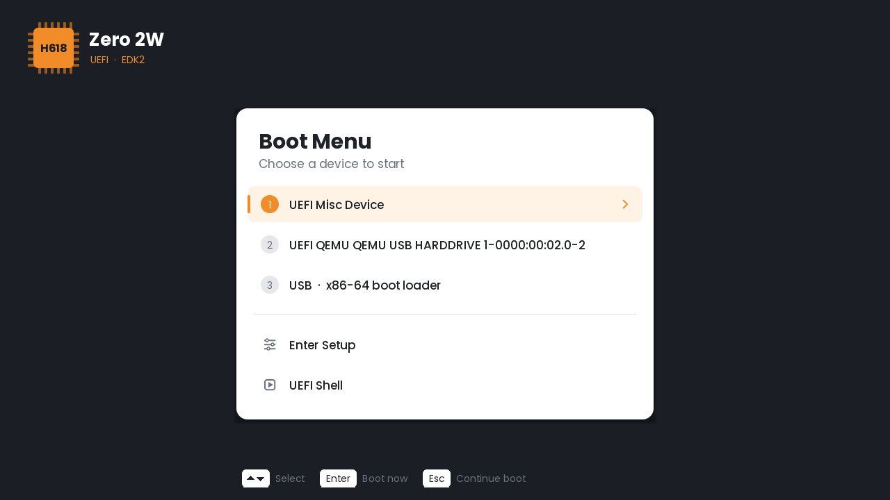
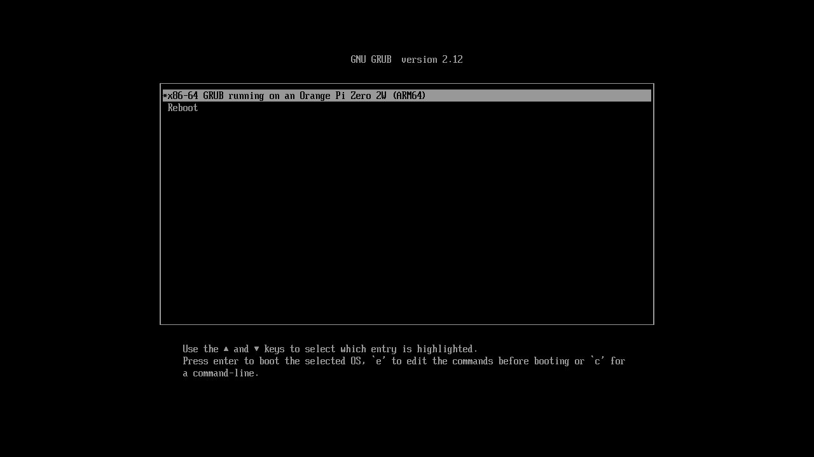

# Orange Pi Zero 2W UEFI

UEFI firmware (TianoCore EDK2) for the **Orange Pi Zero 2W** (Allwinner H618, 1 GB).
It replaces U-Boot proper: the board boots from the microSD card into a UEFI
environment with a graphical setup, USB and HDMI support, Secure Boot and ACPI
tables for Windows on ARM.

<p>
  
  
</p>
<p>
  
  
</p>

Feature status: **[docs/STATUS.md](docs/STATUS.md)**

## Highlights

- Graphical setup (**F2**) and boot menu (**ESC**)
- HDMI output at 1920x1080 (UEFI GOP)
- USB host port with EHCI + OHCI: keyboards, hubs, USB drives, boot from USB
- microSD read/write, FAT and Ext4
- Settings kept on the microSD card (UEFI variables), real-time clock
- UEFI Secure Boot with the Microsoft KEK and db certificates, switched on in setup
- CPU raised to the chip's rated maximum (1416 MHz on most H618), temperature in setup
- ACPI tables (FADT, MADT, GTDT, DSDT, DBG2, SPCR) and SMBIOS
- The OS is started at EL2, so hardware virtualization is available to it
- UEFI Shell
- **x64 Bridge**: an optional x86-64 UEFI emulator in the firmware, so x86-64 UEFI apps and boot loaders run on the ARM64 board
- **x64 Engine** (preview): a whole x86-64 PC emulated by the firmware, boots x86-64 Linux ISOs

## x64 Bridge

The firmware carries an x86-64 UEFI emulator ([MultiArchUefiPkg](https://github.com/intel/MultiArchUefiPkg)
with [unicorn-for-efi](https://github.com/intel/unicorn-for-efi)). It is off by default.

1. **F2** → Config → Compatibility → **x64 Bridge** → Enabled → **F10** (the board restarts).
2. Insert a USB drive with `\EFI\BOOT\BOOTX64.EFI` and press **ESC**: the drive is listed as
   *USB · x86-64 boot loader*.

<p>
  
  
</p>

x86-64 UEFI applications, the x86-64 UEFI Shell and boot loaders such as GRUB run in the emulator
and use the board's native drivers (display, keyboard, USB, microSD). An x86-64 **operating system**
cannot run: once the boot loader hands over to the kernel, UEFI boot services are gone and there is
no CPU emulation left. Emulated code is also much slower than native code.

## x64 Engine (preview)

A complete x86-64 PC run by the firmware itself, so a 64-bit x86 **operating system** can boot on
the board: CPU (unicorn / QEMU TCG in a new system mode), interrupt controller, timer, serial port,
RTC, PS/2 keyboard, PCI, virtio disk and a framebuffer on the HDMI output. It reads the ISO's own
GRUB / isolinux menu and starts the kernel from it; the ISO is the x86 system's `/dev/vda`.

1. Write the ISO to a USB drive (balenaEtcher), or copy the `.iso` file to the root of a FAT32 USB drive.
2. Press **ESC** at boot, choose **x64 PC · run an x86-64 ISO**, pick the ISO and the menu entry.
3. **F12** returns to the firmware. The x86 system's serial console is mirrored on the board's UART.

<p></p>

Status: Ubuntu x86-64 kernels boot to a shell and the Ubuntu `mini.iso` installer runs. Linux ISOs only
(Windows x64 needs more than the board's 1 GB), no network card yet, roughly 10x slower than native.
Source and design notes: [X64Engine/](X64Engine/).

## Install

1. Download `opi-zero2w-edk2-sd-vX.Y.Z.zip` from the [Releases](../../releases).
2. Write `opi-zero2w-edk2-sd.img` to a microSD card with balenaEtcher or Rufus.
3. Connect HDMI and a USB keyboard to the USB-C host port, insert the card and power on.

`opi-zero2w-edk2-boot.bin` is the firmware alone. It can be written over an existing card
at 8 KiB (`dd if=opi-zero2w-edk2-boot.bin of=/dev/sdX bs=1k seek=8`).

| Key during boot | Action |
|---|---|
| F2 | Setup |
| ESC | Boot menu (choose a device, UEFI Shell) |
| Enter | Continue booting |

Serial console: UART0 on the 40-pin header (pin 6 GND, pin 8 TX), 115200 8N1.

## Boot chain

```
BROM
 └─ microSD @ 8 KiB: U-Boot SPL (DRAM + PMIC init)
     └─ FIT image
         ├─ TF-A BL31   0x40000000   EL3, PSCI
         └─ EDK2 FD     0x4A000000   EL2 (2 MiB: DXE firmware volume + 128 KiB variable store)
```

## Build

Ubuntu 24.04 (or WSL2 Ubuntu on Windows, see `scripts/windows/`):

```sh
bash scripts/build-all.sh           # DEBUG build, verbose UART log
bash scripts/build-all.sh RELEASE
```

The script installs the packages, fetches U-Boot v2025.07, TF-A v2.13.0, EDK2 and
edk2-platforms, applies the patches in `patches/` and writes the images to `out/`.

A QEMU test build (`EDK2_EXTRA_FLAGS="-D QEMU_TEST" scripts/build-edk2.sh`) runs the same
firmware on `qemu-system-aarch64 -M virt` with a RAM framebuffer, which is how the
setup screenshots were taken.

## Source layout

| Path | Contents |
|---|---|
| `Platform/OrangePi/OrangePiZero2W` | Board: DSC/FDF, ACPI tables, setup application (`Applications/OpiSetup`), variable store, SMBIOS, logo, Secure Boot keys |
| `Silicon/Allwinner/H616Pkg` | SoC drivers: MMC, USB (EHCI bring-up, OHCI), HDMI (DE33 + TCON + DW-HDMI), RTC, CPU clock and thermal sensor |
| `patches/` | Small patches for EDK2 (USB root port reset, boot hot keys) and TF-A (BL33 hand-off without a DTB) |
| `Platform/OrangePi/OrangePiZero2W/Binaries/EmulatorDxe` | Prebuilt x86-64 emulator driver (`scripts/build-emulator.sh`, patches in `patches/`) |
| `scripts/` | Build and SD image scripts |

## Known limitations

- HDMI EDID cannot be read on this board, the output is always 1920x1080.
- Only the USB host port works, the OTG port on the power connector has no driver.
- No Wi-Fi, Bluetooth or network boot.
- Linux needs a Device Tree boot mode, which is not done yet (ACPI only for now).
- Windows cannot use the microSD card (the controller is not SDHCI); install it on a USB drive.

## Contributors

- limonabisi

## License

BSD-2-Clause-Patent, like EDK2. Third-party parts are listed in [THIRD-PARTY.md](THIRD-PARTY.md).

